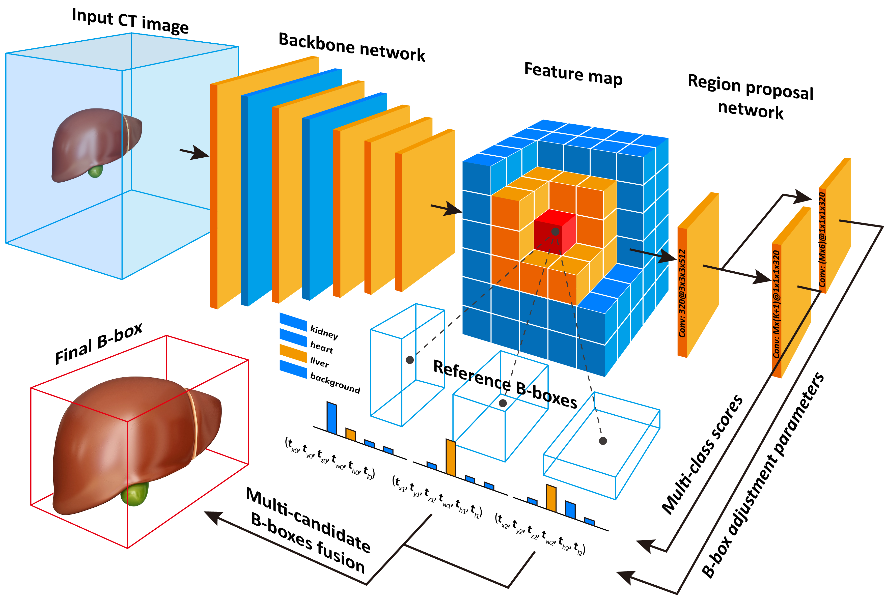

# Caffe with 3D Faster R-CNN
This is a modified version of [Caffe](https://github.com/BVLC/caffe) which supports the **3D Faster R-CNN framework** and **3D Region Proposal Network** as described in our paper [**Efficient Multiple Organ Localization in CT Image using 3D Region Proposal Network**]([Early access](http://doi.org/10.1109/TMI.2019.2894854) on **IEEE Transactions on Medical Imaging**).



This code has been compiled and passed on `Windows 7 (64 bits)` using `Visual Studio 2013`.

## How to build

**Requirements**: `Visual Studio 2013`, `ITK-4.10`, `CUDA 8.0` and `cuDNN v5`

### Pre-Build Steps
Please make sure CUDA and cuDNN have been installed correctly on your computer.

Clone the project by running:
```
git clone https://github.com/superxuang/caffe_3d_faster_rcnn.git
```

In `.\windows\Caffe.bat` set `ITK_PATH` to ITK intall path (the path containing ITK `include`,`lib` folders).

### Build
Run `.\windows\Caffe.bat` and build the project `caffe` in `Visual Studio 2013`.

## How to use
### Download data
Please download and unzip the CT images from [LiTS challenge](https://competitions.codalab.org/competitions/17094) and the organ bounding-box annotations from [here](http://dx.doi.org/10.21227/df8g-pq27). Note that, the original CT images of LiTS dataset are stored in `*.nii` format. Please convert them to `*.mhd` format.

### Prepare data
Move the CT images and the bounding-box annotations to a data folder, and create an entry list file (`_train_set_list.txt`) in the same folder. To this end, the data folder is organized in the folloing way:

```
└── data folder
    ├── _train_set_list.txt
    ├── volume-0.mhd
    ├── volume-0.raw
    ├── segmentation-0.mhd
    ├── segmentation-0.raw
    ├── segmentation-0.txt
    ├── volume-1.mhd
    ├── volume-1.raw
    ├── segmentation-1.mhd
    ├── segmentation-1.raw
    ├── segmentation-1.txt
    |   ....................... 
    ├── volume-130.mhd
    ├── volume-130.raw
    ├── segmentation-130.mhd
    ├── segmentation-130.raw
    └── segmentation-130.txt
```

The entry list file `_train_set_list.txt` stores the filenames that are actually used for training. Each line of the entry list file corresponds a data sample. Here is an example of the entry list file `_train_set_list.txt` corresponding to above data folder. **Note that, the segmentation mask file (`segmentation-N.mhd` and `segmentation-N.raw`) is not necessary for neither training nor testing. We just reserve it for further research (e.g. organ segmentation). You could just make the segmentation mask files absent and fill the second column of the entry list file with a non-existent filename.**  

```
volume-0.mhd segmentation-0.mhd segmentation-0.txt
volume-1.mhd segmentation-1.mhd segmentation-1.txt
.......................
volume-130.mhd segmentation-130.mhd segmentation-130.txt
```

### Start the training
Modify the path parameter of datalayer in `.\models\ours\net.prototxt`.
```
layer {
  name: 'mhd_input'
  type: 'MHDRoiData'
  top: 'data'
  top: 'im_info'
  top: 'gt_boxes'
  mhd_data_param {  
    source: "F:/Deep/MyDataset/LITS/_train_set_list.txt" # the entry list file mentioned above
    root_folder: "F:/Deep/MyDataset/LITS/" # the data folder mentioned above
    batch_size: 1
    shuffle: true
    hist_matching: false 
    truncate_probability: 0.5
    min_truncate_length: 50
    inplane_shift: 5
    min_intensity: -1000
    max_intensity: 1600
    random_deform: 0.0
    deform_control_point: 2
    deform_sigma: 15.0
    contour_name_list {
      name: "liver"
      name: "lung-r"
      name: "lung-l"
      name: "kidney-r"
      name: "kidney-l"
      name: "femur-r"
      name: "femur-l"
      name: "bladder"
      name: "heart"
      name: "spleen"
      name: "pancreas"
    }
    resample_spacing_x: 2
    resample_spacing_y: 2
    resample_spacing_z: 2
    max_width: 150
    max_height: 150
    max_length: 1000
  }
  include: { phase: TRAIN }
}
```
Run `.\models\ours\train.bat`

## License and Citation

Please cite our paper and Caffe if it is useful for your research:

    @article{xu2019organlocalization, 
      author = {Xu, Xuanang and Zhou, Fugen and Liu, Bo and Fu, Dongshan and Bai, Xiangzhi},
      journal = {IEEE Transactions on Medical Imaging},
      title = {Efficient Multiple Organ Localization in CT Image using 3D Region Proposal Network},
      year = {2019}
      doi = {10.1109/TMI.2019.2894854},
      volume = {}, 
      number = {}, 
      pages = {1-1}, 
      ISSN = {0278-0062},
      month = {},
    }

    @article{jia2014caffe,
      author = {Jia, Yangqing and Shelhamer, Evan and Donahue, Jeff and Karayev, Sergey and Long, Jonathan and Girshick, Ross and Guadarrama, Sergio and Darrell, Trevor},
      journal = {arXiv preprint arXiv:1408.5093},
      title = {Caffe: Convolutional Architecture for Fast Feature Embedding},
      year = {2014}
    }
    
Caffe is released under the [BSD 2-Clause license](https://github.com/BVLC/caffe/blob/master/LICENSE).
The BVLC reference models are released for unrestricted use.